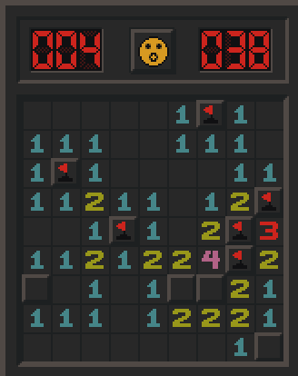
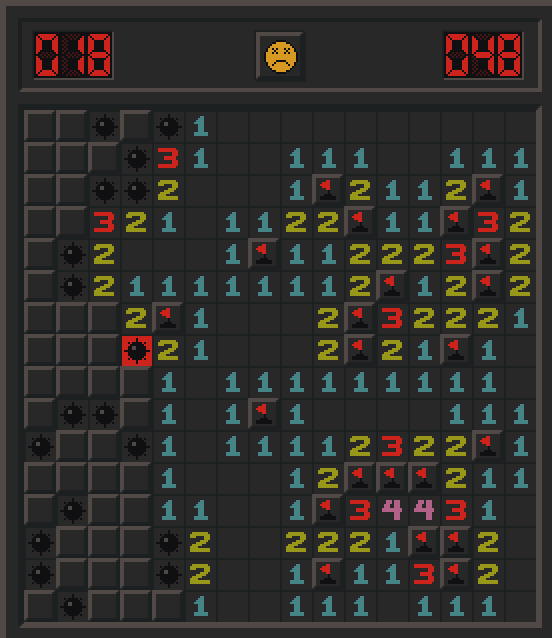
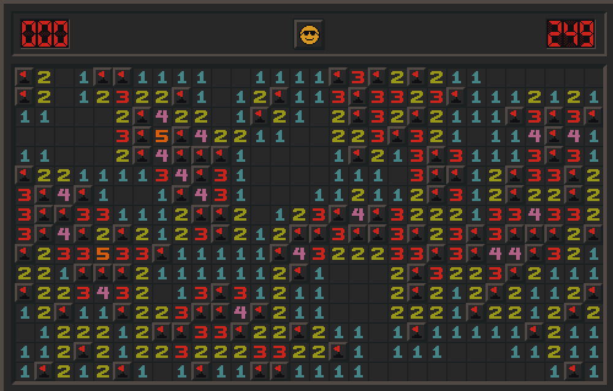

# Zig-sweeper

A Windows XP inspired Minesweeper game in Zig, using Raylib for graphics.

## Features

- All 3 classic minesweeper modes:
    - beginner: 9x9 with 10 bombs
    - intermediate: 16x16 with 40 bombs
    - expert: 30x16 with 99 bombs
- Custom grid.
- Scalable window.
- Custom camera that allows zooming into the grid.
- Clicking on cells with the correct number of flags will open surrounding cells.

## Building

You will need Zig version `0.13.0` to compile this project.

```bash
zig build
```
The compiled program will be in `./zig-out/bin/zig-sweeper`.

## Nix

Try it out directly!
```bash
nix run 'github:frost-phoenix/zig-sweeper' -- --help
```

### Or install it in your flake

- First you need to import it in your flake inputs
```nix
# flake.nix
{
  inputs = {
    zig-sweeper.url = "github:frost-phoenix/zig-sweeper";
    # ...
  };
  # ...
}
```

- Then, you can add it to your pkgs list
```nix
{ inputs, ... }:
{
  home.packages = [
    inputs.zig-sweeper.packages.${system}.default
    # ...
  ];
  # ...
}
```

## Usage

You can run it directly using the following command:
```bash
zig build run -- --help
```
If you use this method, all arguments you pass to the program must be placed after `--`.

```
Usage: zig-sweeper [difficulty] [custom_grid_options] [options]

Difficulties:

  beginner                 9x9  with 10 bombs
  intermediate            16x16 with 40 bombs
  expert                  30x16 with 99 bombs

  custom <nb_cols> <nb_rows> <nb_bombs>

Custom grid options:

  <nb_cols>               between 5 and 115
  <nb_rows>               between 5 and  70
  <nb_bombs>              must be less than nb_cols * nb_rows

General Options:

  -s, --scale <amount>    Set window scale (default 2, max 5)
  -h, --help              Print this help message and exit

Keybinds:

  <ESC>                   Quit
   <n>                    Generate new grid
   <o>                    Open all cells
   <r>                    Reset grid zoom and position

Mouse:

  left click              Open cell
  right click             Flag cell
  middle click            Drag grid when zoomed in
  wheel scroll            Zoom grid in/out
```

## Screenshots

| | | |
|:-------------------------:|:-------------------------:|:-------------------------:|
|  beginner |  intermediate |  expert |

## TODO

See [TODO.md](TODO.md).

## Acknowledgments

A huge thanks to:

- [Not-Nik](https://github.com/Not-Nik), who made the incredible [raylib-zig](https://github.com/Not-Nik/raylib-zig) bindings.
- [Cloudef](https://github.com/Cloudef), who created the amazing [zig2nix](https://github.com/Cloudef/zig2nix) tool and  was super helpful in getting it working.

## License

See [LICENSE](LICENSE)